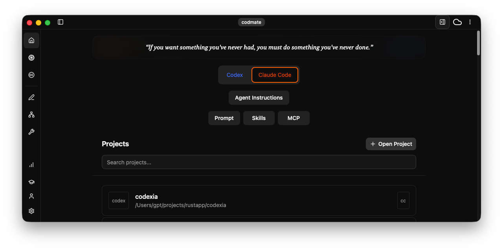

# Codexia

[](docs/README.zh-CN.md)
[](https://discord.gg/zAjtD4kf5K)
[](http://x.com/intent/follow?screen_name=lisp_mi)

A powerful cross-platform GUI and toolkit for Codex CLI and Claude Code, designed to streamline AI-assisted development.

It can also be used as a general-purpose AI agent workspace for research, writing, and everyday workflows.

One-click file injection from the File Tree, prompt notepad integration, Git worktree support, diff viewer, and built-in PDF / CSV / XLSX preview — all in one place.

> [!TIP]
> ⭐ **Star this repo**, follow **[milisp](https://github.com/milisp)** on GitHub for more projects, and follow **[@lisp_mi](https://x.com/lisp_mi)** on Twitter for updates.




▶️ [Automation demo on Twitter](https://x.com/lisp_mi/status/1966147638266589376)

## 📋 Table of Contents
- [✨ Features](#-features)
- [✨ Claude code features](#claude-code-features)
- [🚀 Installation](#-installation)
- [📖 Quick start](#-quick-start)

## ✨ Features

### 🗂️ **Project & Session Management**
- **Visual Project Browser**: Navigate through all your Codex CLI projects in `~/.codex/config.toml` and any `~/.codex/sessions/**/*.jsonl` first line has cwd
- **Session History**: View and resume past coding session with full context, Rename chat title, manage `~/.codex/sessions`
- Filter conversation messages
- Open multiple projects simultaneously in separate windows
- Organize conversations with categories and favorites

### 🌱 Git Worktree & File Sync
- Git worktree with file sync to prevent accidental deletion of changes, including undo support.

### 🌐 Remote Control
- Remote control from any device via a web browser

### Built-in multi file viewer format support

One-click PDF / XLSX / CSV preview directly from the File Tree

- PDF text selection
- CSV/XLSX preview & selection

### 📝 Prompt Notepad
- Seamless notepad and chat integration

### 📊 **Usage Analytics Dashboard**
- **Cost Tracking**: Monitor your usage and costs in real-time
- **Token Analytics**: Detailed breakdown by model, project, and time period
- **Visual Charts**: Beautiful charts showing usage trends and patterns

### 🔌 **MCP Server Management**
- MCP marketplace and management for both codex and Claude code
- One click add from mcp marketplace or sync mcp server via [mcp-linker](https://mcp-linker.store)

### Agent/Claude Skills
- Agent skills marketplace and management

### 📝 **AGENTS.md**
- **Built-in Editor**: Edit AGENTS.md file directly within the app
- **Live Preview**: See your markdown rendered in real-time
- **Syntax Highlighting**: Full markdown support with syntax highlighting

### 🎯 **Professional UX**
- Syntax-highlighted markdown
- Todo plan display
- ~~Fork chat~~
- Persistent UI state
- WebPreview (e.g., Next.js http://localhost:3000)
- Theme & Accent selection

### 📋 Codex CLI features
- Sandbox execution modes for safe code running
- Approval workflows for sensitive operations
- Configurable command execution policies
- Isolated processes per session for security
- Image input via screenshots or image files
- Toggle Codex built-in OpenAI model (GPT-5, o3, etc.) web search
- Project-aware assistance
- Multiple AI providers (OpenAI, Ollama)

### 🗄️ Local Cache (SQLite)

Codexia uses a local SQLite database at `~/.codexia/cache.db` to store:
- Notes
- Session metadata
- Token usage statistics

## Claude code features
- show projects from ~/.claude.json
- Display all Claude Code sessions from `~/.claude/projects`
- show active sessions
- continue or resume session from GUI
- send prompt or click pencil icon to start new session 

## 🚀 Installation

### Prerequisites
- **Codex CLI**: Install from [github Codex](https://github.com/openai/codex)
- **Claude Code CLI**: Install from [Claude's official site](https://claude.ai/code)
- **Git**: recommend option install

### Download

- [release](https://github.com/milisp/codexia/releases)
- [modern-github-release](https://milisp.github.io/modern-github-release/#/repo/milisp/codexia)

### macOS homebrew

```sh
brew tap milisp/codexia
brew install --cask codexia
```

## 📖 Quick start

This is the fastest way to get started with Codexia:

- Launch Codexia app
- UI show Project with codex projects and Claude code projects

### Codex
- Option step (config model, sandbox, approval)
- select a project then start task

### Claude code
- select a project to show history sessions
- Option step (config)
- send prompt to start agent or plan

### Remote control

Download codexia-web or build from source code then

#### start web server

```sh
codexia --web
```

#### Linux/Macos 
```
bash scripts/package-web.sh
```

#### Windows

```
scripts/package-web.bat
```

### Others
- Google or ask AI

## 💬 Discussions

Join the [Discussions](https://github.com/milisp/codexia/discussions)

## Community forks

- [jeremiahodom/codex-ui](https://github.com/jeremiahodom/codex-ui) - Node.js backend with API/SSE communication
- [Itexoft/codexia](https://github.com/Itexoft/codexia) - SSH integration
- [nuno5645/codexia](https://github.com/nuno5645/codexia) - add support for new reasoning and token count events

## Related project
- [awesome-codex-cli](https://github.com/milisp/awesome-codex-cli) - A curated list of awesome resources, tools for OpenAI Codex CLI

## 🤝 Contributing

We welcome contributions! Please see our [Contributing Guide](CONTRIBUTING.md) for details.

By contributing to this project, you agree that your contributions may be licensed under both the AGPL-3.0 license and the Codexia commercial license.

### Areas for Contribution

- 🐛 Bug fixes and improvements
- ✨ New features and enhancements
- 📚 Documentation improvements
- 🎨 UI/UX enhancements
- 🧪 Test coverage
- 🌐 Internationalization

## 🙏 Acknowledgments

- [Plux](https://github.com/milisp/plux) one click @files from FileTree & notepad
- Built with [Tauri](https://tauri.app/) - The secure framework for building desktop apps
- [Claude](https://claude.ai) by Anthropic
- [Codex](https://github.com/openai/codex) by OpenAI
- [CodexMonitor](https://github.com/Dimillian/CodexMonitor) - Codex app-server v2 with workspace support

---

[Report Bug · Request Feature](https://github.com/milisp/codexia/issues)

## License

Codexia is dual-licensed under **AGPL-3.0** and a **Commercial License**.

- **AGPL-3.0** — for open-source use.
- **Commercial License** — required for closed-source, proprietary, hosted, or SaaS use.

For full terms and commercial inquiries, see [COMMERCIAL.md](COMMERCIAL.md).

### 💡 Quotes and books

Codexia includes a small collection of inspirational quotes and recommended books

- Random wisdom quotes
- A curated list of awesome book

These assets live in the `public/` directory, and contributions are welcome.