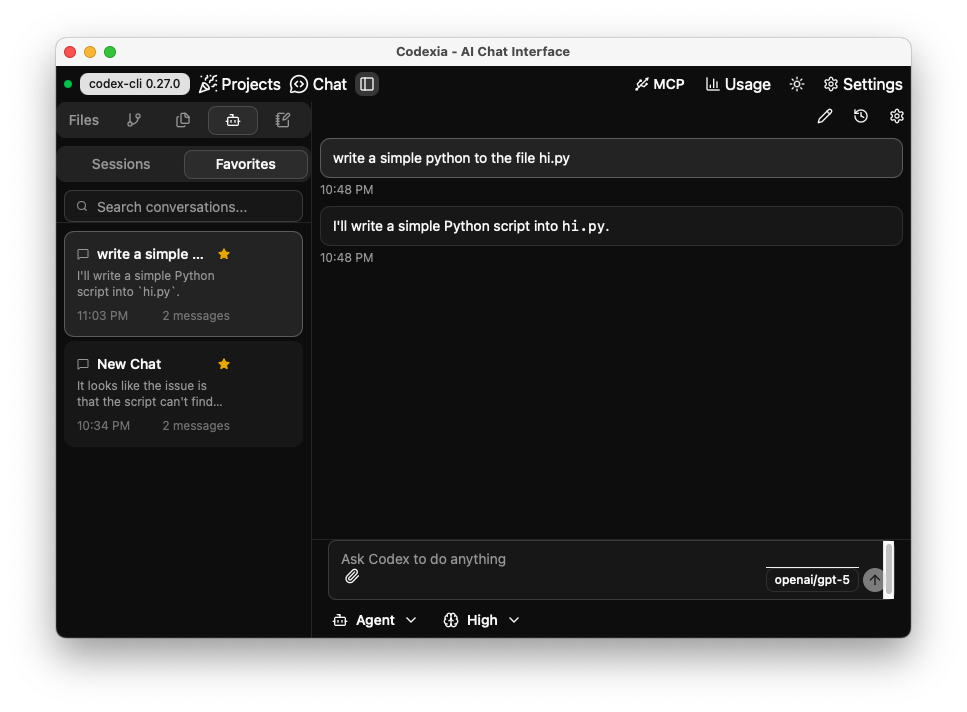

<div align="center">
  

  # [Codexia](https://github.com/milisp/codexia)
</div>

[](https://github.com/milisp/codexia/releases)
[](https://github.com/milisp/codexia/stargazers)
[](https://github.com/milisp/codexia/network/members)
[](https://github.com/milisp/codexia/issues)
[](https://github.com/milisp/codexia/labels/feature-request)
[](#-contributing)
[](LICENSE)
[](https://github.com/milisp/codexia/actions/workflows/ci.yml)

🚀 The missing GUI/IDE for the [Codex CLI](https://github.com/openai/codex) — fork chat, live streaming responses, file-tree integration, notepad, and git diff support
Cross-platform desktop app built with Tauri v2 + React + TypeScript.

> [!TIP]
> **⭐ Star the repo and follow [milisp](https://x.com/lisp_mi) on X and [github](https://github.com/milisp) for more**.



▶️ [Watch the automation video on Twitter](https://x.com/lisp_mi/status/1963633403368280221)

## Disclaimer

Codexia is an independent open-source project and is not built by OpenAI or any company.

## News

- [2025-09-05] fork chat(preview)
- [2025-09-03] show the plan message
- [2025-08-29] support image input, codexia can read image now

## ✨ Features

### 🔄 **Multi-Session Support**
- Run multiple independent chat sessions simultaneously
- Each session maintains its own configuration and context
- Switch between sessions without interrupting ongoing conversations
- Persistent session storage with automatic restoration on app restart

### 💬 **Real-Time Streaming**
- Live streaming responses for immediate feedback
- Character-by-character message updates as AI generates responses
- No more waiting for complete responses - see results as they appear
- Visual indicators for active generation and thinking states

### Build-in Mutil file format support

- pdf - select text from pdf
- csv, xlsx - preview and select text

### ⚙️ **Flexible Configuration**
- Support for multiple AI providers (OpenAI, OSS via Ollama, Custom)
- Configurable models per session (GPT, Llama, etc.)
- Adjustable sandbox policies (read-only, workspace-write, full-access)
- Customizable approval policies for command execution
- Working directory selection for each session

### 🎯 **Professional UX**
- Clean, responsive interface built with shadcn/ui components
- Configuration panel
- **Notepad-chat integration** for seamless note-taking and send back during conversations
- **Enhanced markdown rendering** with syntax highlighting for code blocks
- **Todo list** Plan Display
- Screenshot as image input
- fork chat
- Persistent UI state and preferences
- **WebPreview** Click WebPreview icon Auto detect web port to show WebPreview, eg. Next.js project will show WebPreview `http://localhost:3000`
- Theme & Accent Selection

### 🛡️ **Security & Control**
- Sandbox execution modes for safe code running
- Approval workflows for sensitive operations
- Configurable command execution policies
- Isolated processes per session for security

## 🚀 Getting Started

### Prerequisites

- [Tauri Prerequisites](https://v2.tauri.app/start/prerequisites/)

### Installation

1. **Clone the repository:**
   ```bash
   git clone https://github.com/milisp/codexia
   cd codexia
   ```

2. **Install dependencies:**
   ```bash
   bun install
   ```

3. **Run the development server:**
   ```bash
   bun tauri dev
   ```

### Building for Production

```bash
bun tauri build
```

## 🎮 Usage

### Creating Sessions
- Click the **"+"** button in the session sidebar to create a new chat session
- Each session starts with an independent Codex process
- Configure working directory, model, and policies per session

### Managing Conversations
- Switch between sessions by clicking on them in the sidebar
- Sessions continue running in the background when not active
- Close sessions using the **"×"** button (this terminates the Codex process)

### Configuration
- Click the **Settings** icon to open the configuration dialog
- Changes apply to the currently active session
- Configurations are automatically saved and restored

### Theme & Accent Selection
- Toggle light/dark with the sun/moon button in the header.
- Pick an accent color from the palette button next to the theme toggle.
- Defaults: dark mode with a pink accent. Choices persist via Zustand.

### Monitoring
- Use the **Debug** panel (bottom-right) to monitor running sessions
- View backend process status and frontend session states
- Sync session states between frontend and backend

## 🏗️ Architecture

### Frontend (React + TypeScript)
- **Zustand** for state management with persistence
- **shadcn/ui** for UI components
- **Tauri** for native desktop integration
- **Real-time event handling** for streaming responses

### Backend (Rust + Tauri)
- **Multi-process management** for concurrent Codex sessions
- **JSON-RPC protocol** communication with Codex CLI
- **Async event streaming** to frontend
- **Resource cleanup** and process lifecycle management

### Session Management
- **Independent processes** per chat session
- **Configurable startup parameters** per session
- **Event isolation** between sessions
- **Graceful cleanup** on session termination

## 📋 Supported Codex Features

- ✅ **Interactive chat** with AI assistants
- ✅ **Code generation and editing** in various languages
- ✅ **File operations** with sandbox controls
- ✅ **Command execution** with approval workflows
- ✅ **Multiple AI providers** (OpenAI, OSS models via Ollama)
- ✅ **Working directory context** for project-aware assistance
- ✅ **Streaming responses** for real-time interaction - by config show_raw_agent_reasoning=true

## 🛠️ Development

### Project Structure
```
codexia/
├── src/                    # React frontend source
│   ├── components/         # UI components
│   ├── hooks/              # Custom React hooks
│   ├── store/              # Zustand state management
│   ├── services/           # Business logic services
│   └── types/              # TypeScript type definitions
├── src-tauri/              # Rust backend source
│   ├── src/
│   │   ├── lib.rs          # Main Tauri application
│   │   └── codex_client.rs # Codex process management
│   └── Cargo.toml          # Rust dependencies
├── public/                 # Static assets
└── package.json           # Node.js dependencies
```

### Key Technologies
- **Frontend**: React 19, TypeScript, Zustand, shadcn/ui, Vite
- **Backend**: Rust, Tauri v2, Tokio async runtime
- **Process Communication**: JSON-RPC, stdin/stdout streams
- **State Management**: Zustand with persistence middleware
- **UI Framework**: shadcn/ui built on Radix UI and Tailwind CSS

### Development Commands
```bash
# Start development server
bun tauri dev

# Build frontend only
bun run build

# Check Rust code
cd src-tauri && cargo check

# Format code
cd src-tauri && cargo fmt --all

# Copy the pre-commit hook to prevent frontend issues.
cp docs/pre-commit .git/hooks/pre-commit
```

## ❓ Troubleshooting / FAQ

### 1. App fails to start after dependency changes
- **Fix**: Delete `node_modules` and `bun.lock` and reinstall.  
  ```bash
  rm -rf node_modules bun.lock
  bun install
  ```

### 2. Can I use ChatGPT Plus or Pro tier account instead of API

- Yes, You can use codex login ChatGPT first

```sh
codex # then choose ChatGPT
```

## learn tauri v2

https://v2.tauri.app/start/

https://tauri.app/llms.txt

## 🤝 Contributing

1. Fork the repository
2. Create your feature branch (`git checkout -b feature/amazing-feature`)
3. Commit your changes (`git commit -m 'Add some amazing feature'`)
4. Push to the branch (`git push origin feature/amazing-feature`)
  - test before push
  - test command `bun run build` and `cargo check` at src-tauri folder
5. Open a Pull Request

## 💖 Contributors

Thanks to all our wonderful contributors!

<a href="https://github.com/milisp/codexia/graphs/contributors">
  
</a>

## 📄 License

This project is licensed under the MIT License - see the [LICENSE](LICENSE) file for details.

## 🙏 Acknowledgments

- [Plux](https://github.com/milisp/plux) one click @files from FileTree & notepad
- [Claude code](https://www.anthropic.com/claude-code) Co-Authored-By Claude code
- [codex](https://chatgpt.com/codex) for the Codex CLI
- [Tauri](https://tauri.app/) for the excellent desktop app framework
- [shadcn/ui](https://ui.shadcn.com/) for the beautiful UI components
- [ChatGPT](https://chatgpt.com) Some code suggest by ChatGPT
- The open source community for the amazing tools and libraries

---

**Built with ❤️ using Tauri, React, and Rust**
