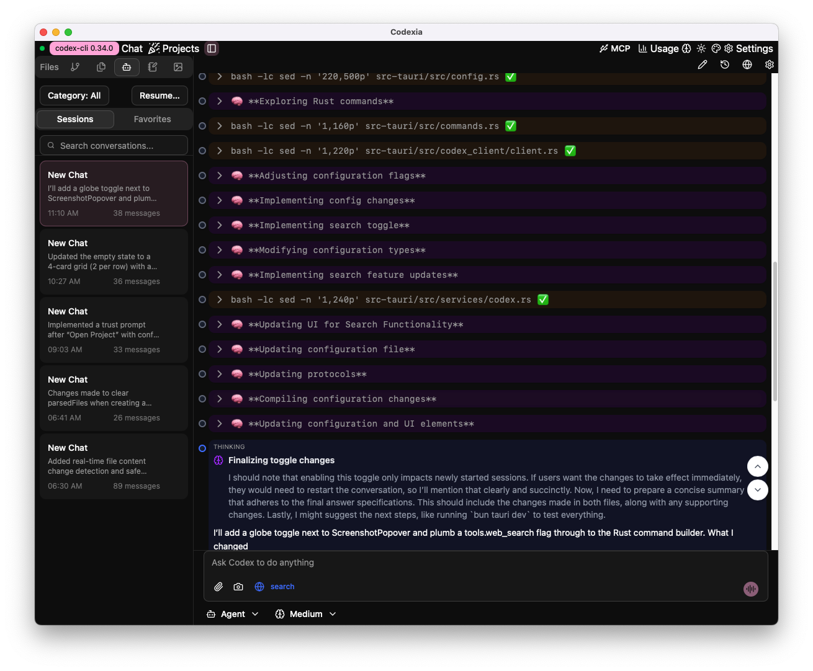

<div align="center">
  

  # [Codexia](https://github.com/milisp/codexia)
</div>

[](https://github.com/milisp/codexia/releases)
[](https://github.com/milisp/codexia/stargazers)
[](https://github.com/milisp/codexia/network/members)
[](https://github.com/milisp/codexia/discussions/new?category=ideas)
[](#-contributing)
[](LICENSE)
[](https://github.com/milisp/codexia/actions/workflows/ci.yml)
[](http://x.com/intent/follow?screen_name=lisp_mi)
[](https://discord.gg/zAjtD4kf5K)

🚀 A powerful GUI and Toolkit for [Codex CLI](https://github.com/openai/codex)

fork chat, file-tree integration, notepad, git diff, build-in pdf csv/xlsx viewer, and more.

[Download](https://milisp.github.io/modern-github-release/#/repo/milisp/codexia) | [USAGE](docs/USAGE.md) | [We welcome contributions](CONTRIBUTING.md) | [ARCHITECTURE](docs/ARCHITECTURE.md) | [FAQ](#faq)

> [!TIP]
> **⭐ Star the repo and follow [milisp](https://github.com/milisp) on Github for more project**.

<div style="display: flex; gap: 10px; justify-content: center;">
  <div style="text-align: center;">
    
    <p>Reason</p>
  </div>
  <div style="text-align: center;">
    
    <p>Web Search</p>
  </div>
</div>

▶️ [Watch the automation video on Twitter](https://x.com/lisp_mi/status/1966147638266589376)

## Related project
- [codexia-zen](https://github.com/milisp/codexia) - a minimalist design GUI for OpenAI Codex CLI, baby Codexia
- [Codexsm](https://github.com/milisp/codexsm) - Codex cli session manager, rename, view, delete session file, one click resume session.
- [MCP Linker](https://github.com/milisp/mcp-linker) - Tauri GUI for managing MCP for Codex CLI
- [awesome-codex-cli](https://github.com/milisp/awesome-codex-cli) - A curated list of awesome resources, tools for OpenAI Codex CLI

## News

- [2025-10-24] Multilingual support - English, Chinese and Japanese.
- [2025-10-04] change codex proto to app-server for codex 0.44.0
- [2025-09-26] With multiple windows support, open multiple projects at the same time. Show token usage beside Reasoning Effort.
- [2025-09-24] Remote control via browser, check [discussion comment](https://github.com/milisp/codexia/discussions/22#discussioncomment-14500403)
- [2025-09-11] support codex built-in web search + file and filetree change detect and refresh
- [2025-09-05] fork chat + edit chat
  * (theme select + category conversatin) ideas thanks to reddit user [rachelo3](https://racheluidesign.weebly.com/?utm_source=https://github.com/milisp/codexia)

## ✨ Features

- Share project to community and find a co-founder at explore page - every user can share two projects.
- 🔄 **Multi-Session Support**
- 💬 **Real-Time Streaming**
- multiple windows support, open multiple projects at the same time
- remote control from browser

### Build-in Mutil file format support

- PDF text selection
- CSV/XLSX preview & selection

### ⚙️ **Flexible Configuration**
- Multiple AI providers (OpenAI, Ollama, Gemini, openrouter, xAI, Custom) - see [config.toml](docs/config.toml)
- Per-session model configs
- Adjustable sandbox policies
- Custom approval workflows
- Select working directory

### 🎯 **Professional UX**
- Responsive UI with shadcn/ui
- Config panel
- Notepad-chat integration
- Syntax-highlighted markdown
- Todo plan display
- Screenshot as input
- Fork chat
- Persistent UI state
- Auto WebPreview (e.g., Next.js http://localhost:3000)
- Theme & Accent selection

### 🛡️ **Security & Control**

Codexia prioritizes your privacy and security:

#### Codex CLI features
- Sandbox execution modes for safe code running
- Approval workflows for sensitive operations
- Configurable command execution policies
- Isolated processes per session for security

#### Privacy
- **Local Storage**: All data stays on your machine
- **No Telemetry**: No data collection or tracking
- **Open Source**: Full transparency through open source code

## Documentation

- Usage and setup: [USAGE](docs/USAGE.md)
- Architecture overview: [ARCHITECTURE](docs/ARCHITECTURE.md)
- Development and contributing: [CONTRIBUTING](CONTRIBUTING.md)

### FAQ

- Why other providers no support
codex 0.4.4 maybe change chat completions api to response api, you can try change base_url to response base_url
- MacOS damaged warning
[🎥Youtube](https://www.youtube.com/watch?v=MEHFd0PCQh4)
The app not sign yet, You can open it by running the terminal command:

```sh
xattr -cr /Applications/codexia.app
open -a /Applications/codexia.app  # or click the Codexia app
```

## 📋 Supported Codex Features

- ✅ Interactive chat
- ✅ Code generation/editing
- ✅ File operations with sandbox
- ✅ Command execution with approval
- ✅ Multiple AI providers
- ✅ Project-aware assistance
- ✅ Streaming responses
- ✅ Built-in Web Search

## 🛣️ Roadmap

- [x] MCP tool call
- More file format support
- Better UI customization
- Plugin system
- Advanced debugging tools
- Real-time collaboration
- Performance optimizations
- token count

🚀 **Call to Action**

If you’re a developer, designer, or AI tinkerer — Join us on this exciting journey to redefine the developer experience with AI. Contribute to the project, share your feedback, and help build the future of intelligent coding environments. Together, we can make Codexia the go-to platform for developers worldwide!

## Development & Support Docs

For development commands, troubleshooting/FAQ, and contribution guidance, see [CONTRIBUTING](CONTRIBUTING.md) and [USAGE](docs/USAGE.md).

### What we need
- docs improve
- make the UI more clean.

## 💬 Discussions

Join the [Discussions](https://github.com/milisp/codexia/discussions)

## Community forks

- [jeremiahodom/codex-ui](https://github.com/jeremiahodom/codex-ui) - Node.js backend with API/SSE communication
- [Itexoft/codexia](https://github.com/Itexoft/codexia) - SSH integration
- [nuno5645/codexia](https://github.com/nuno5645/codexia) - add support for new reasoning and token count events

## 💖 Contributors

Thanks to all our wonderful contributors!

<a href="https://github.com/milisp/codexia/graphs/contributors">
  
</a>

## 📄 License

This project is licensed under the MIT License - see the [LICENSE](LICENSE) file for details.

## Disclaimer

Codexia is an independent open-source project and is not built by OpenAI or any company.

## 🙏 Acknowledgments

- [Plux](https://github.com/milisp/plux) one click @files from FileTree & notepad
- [Claude code](https://www.anthropic.com/claude-code) Co-Authored-By Claude code
- [codex](https://chatgpt.com/codex) for the Codex CLI
- [Tauri](https://tauri.app/) for the excellent desktop app framework
- [shadcn/ui](https://ui.shadcn.com/) for the beautiful UI components
- [ChatGPT](https://chatgpt.com) Some code suggest by ChatGPT
- The open source community for the amazing tools and libraries

---

**Built with ❤️ using Tauri, React, and Rust**

## 📈 Star History

[](https://star-history.com/#milisp/codexia)
