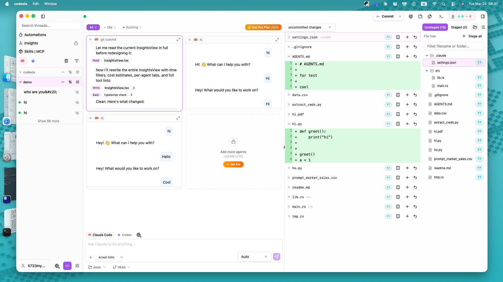

# Codexia

[](https://github.com/milisp/codexia/releases)
[](https://discord.gg/zAjtD4kf5K)
[](http://x.com/intent/follow?screen_name=lisp_mi)

Codexia is a **Tauri v2 app** for Codex CLI + Claude Code — combining agent workflows, an IDE-like editor, a headless web server, and a prompt notepad in one workspace.



## Features

- **Agent workflows**: Task Scheduler for recurring jobs, remote control via headless web server
- **Workspace**: Git worktree management, project file tree, IDE-like editor, prompt notepad, local web preview
- **Data tools**: One-click PDF / XLSX / CSV preview
- **Ecosystem**: MCP server marketplace, agent skills marketplace
- **Personalization**: Theme and accent customization, usage analytics dashboard

## Requirements

- [Codex CLI](https://github.com/openai/codex)
- [Claude Code CLI](https://claude.ai/code)

## Installation

### Homebrew (macOS)
```sh
brew tap milisp/codexia
brew install --cask codexia
```

### Prebuilt releases (macOS / Linux / Windows)
- [GitHub Releases](https://github.com/milisp/codexia/releases)
- [Modern GitHub Release Mirror](https://milisp.github.io/modern-github-release/#/repo/milisp/codexia)

## Quick Start

1. Launch Codexia.
2. Add your project directory.
3. Enter a prompt and start your agent session.
4. Create an Agent Task Scheduler job for recurring workflows.

## Architecture at a Glance
- Codex app-server integration
- Claude agent rust sdk integration
- Frontend: React + TypeScript + Zustand + shadcn/ui in `src/`
- Desktop backend: Tauri v2 + Rust in `src-tauri/src/`
- Headless backend: Axum web server for remote control in `src-tauri/src/web_server/`
- Agent runtime: Codex `app-server` JSON-RPC integration for session/turn lifecycle
- Real-time updates: WebSocket broadcast stream at `/ws` for browser clients

Core entry points:
- `src-tauri/src/lib.rs` (desktop commands and state)
- `src-tauri/src/web_server/server.rs` (headless server startup)
- `src-tauri/src/web_server/router.rs` (HTTP API route surface)
- `src/services/tauri/` (frontend invoke layer)

## API Surface
Codexia exposes a browser-accessible API when running in web/headless mode:

- Health and stream: `GET /health`, `GET /ws`
- Codex lifecycle: `/api/codex/thread/*`, `/api/codex/turn/*`, `/api/codex/model/*`, `/api/codex/approval/*`
- Automation scheduler: `/api/automation/*` (create/update/list/run/pause/delete)
- Files, git, and terminal: `/api/filesystem/*`, `/api/git/*`, `/api/terminal/*`
- Claude integration: `/api/cc/*`
- Notes and productivity: `/api/notes/*`, `/api/codex/usage/token`

Contributor note:
- Add new API handlers under `src-tauri/src/web_server/handlers/`
- Register routes in `src-tauri/src/web_server/router.rs`
- Add corresponding frontend client calls in `src/services/tauri/`

## Documentation

- [Usage](docs/USAGE.md)
- [Architecture](docs/ARCHITECTURE.md)
- [Web Server](docs/WEB_SERVER.md)

## 🔒 Security

- **Process isolation**: Agents run in separate processes
- **Permission control**: Configure file and network access per agent
- **Local storage**: All data stays on your machine
- **Open source**: Full transparency through open source code
- **Telemetry**: Opt-in only, off by default

## Contributing

Contributions are welcome. Read [CONTRIBUTING.md](CONTRIBUTING.md) for setup and workflow.

Community forks:
- [jeremiahodom/codex-ui](https://github.com/jeremiahodom/codex-ui) — Node.js backend with API/SSE
- [Itexoft/codexia](https://github.com/Itexoft/codexia) — SSH integration
- [nuno5645/codexia](https://github.com/nuno5645/codexia) — Reasoning and token count events

Related: [awesome-codex-cli](https://github.com/milisp/awesome-codex-cli)

## Community

- [GitHub Discussions](https://github.com/milisp/codexia/discussions)
- [Report Bug / Request Feature](https://github.com/milisp/codexia/issues)

## License

Dual-licensed under **AGPL-3.0** (open source) and a **Commercial License** (closed-source / SaaS use).
See [COMMERCIAL.md](COMMERCIAL.md) for details.
